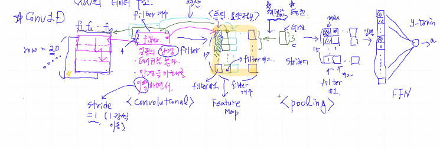
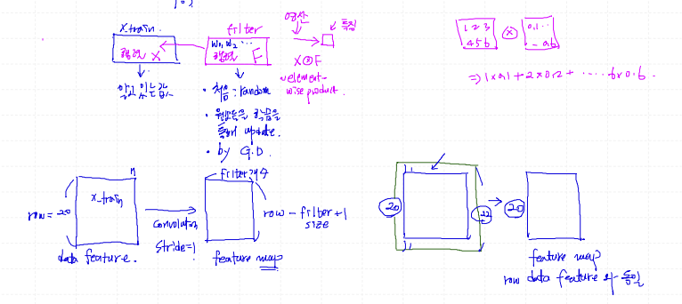
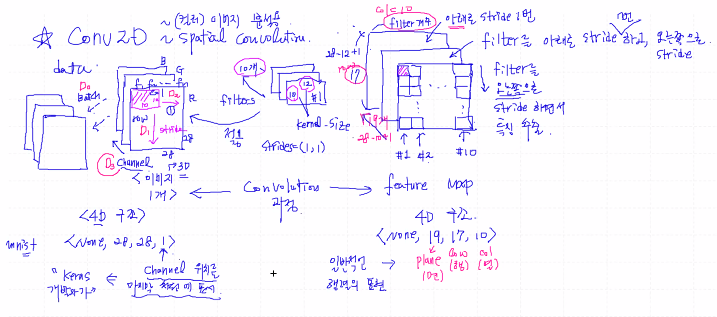
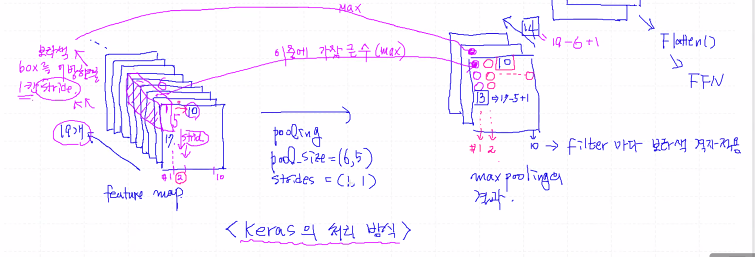
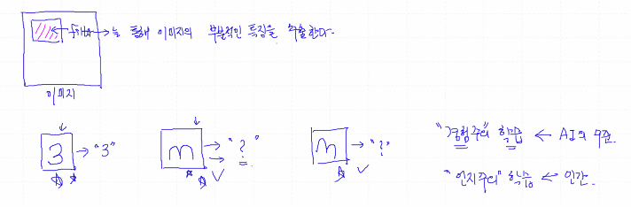

# CNN (Convolution Neural Network)

- 합성곱 신경망

- 용도

  - 시계열 데이터 분석
  - 이미지 분석 (특히 뛰어남)

- `many-to-one` 만 사용

  과거부터 현재까지의 흐름 (Sequence 분석)

- `filter` : 학습 대상(trainable parameter)

- `data -> convolution -> pooling(optional) -> convolution -> pooling -> ... -> FNN`


## Conv 1D



### Convolutional

- 일종의 안경(**filter**)으로 데이터를 봄 (아래로 이동(**stride** = 1, 1칸씩 이동)하면서 / 특징,요약정보 저장)

- 여러 가지의 안경(**filter**)를 사용하면서 특징 요약 정보를 기록한다

  위 과정을 **Convolutional** 과정이라고 하고 기록된 정보를 Feature Map(특징 요약정보)이라고 함

### Pooling

- Feature Map의 Grid 중에서 최대값이나 평균을 구한다
- 각 filter 별로 기록 -> 입력 -> y-train (FNN)

### Padding

- feature map의 크기 조절용
- data feature의 **경계** 지점을 잘 포착하기 위해서




### 사용법

```python
x_input = Input(batch_shape=(None, n_row, n_col)) # 3D 구조

h_conv = Conv1D(filters=30,
                Kernel_size=4,
                strides=1,
                padding='valid',
                activation='relu')(x_input)
# padding = 'same' 알아서 적용, valid는 적용 x

h_pool = MaxPooling1D(pool_size=3, strides=1, padding='valid')(h_conv)

h_flat = Flatten()(h_pool) # 2차원 구조를 1차원 구조로 (일렬 정렬)

y_output = Dense(1)(h_flat) # default = None
```


## Conv 2D

spatial convolution (컬러 이미지 분석용)


### Convolution




### Pooling

- 2 방향 Stride




### 사용법

```python
x_input = Input(batch_shape=(None, 28, 28, 1)) # mnist, 흑백이미지 의 경우

h_conv = Conv2D(filter=10,
                kernel_size=(10,12),
                strides=1,
                padding='valid',
                activation='relu')(x_input)

h_pool = MaxPooling2D(pool_size=(6,5), strides=1, padding='valid')(h_conv)

h_flat = Flatten()(h_pool)

y_output = Dense(10, activation='softmax')(h_flat)

# model.summary() 결과
h_conv -> (None, 19, 17, 10)
h_pool -> (None, 14, 13, 10)
```




- 참고

  image data -> convolution(size down) -> **inverse convolution**(size up) -> image 생성 복원