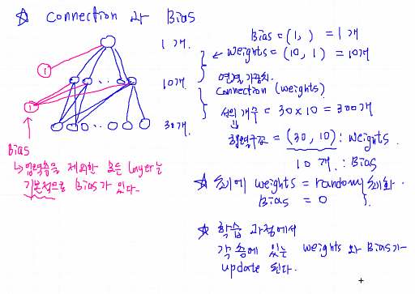
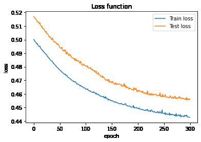

# Deep Learning

- `인공신경망`, `Neural Network`

- Network 구조를 이용해서 Data 분석

- 흐름이 한 방향 구조 : `FFN : Feed Forward Network`

  #### :star: **`Shape`**을 맞춰주는 것이 매우 중요 : `error` 방지


## 1. 신경망 (= Perceptron)


각각의 선 : 연결 가중치 (`Connection Weights`)

각각의 노드 : 신경세포 (`Neuron`)


1. **`입력층`** (Input Layer)

   `feature의 개수 만큼`

   입력 값을 다음 노드에 전달하는 창구 역할 (가중 합, 활성 함수 계산을 하지 않음)

   - 시스템 외부로 부터 입력을 받아 시스템으로 값을 전송

   

2. **`은닉층`** (Hidden Layer)

   `사람의 눈에 보이지 않음`

   신경망의 외부에서는 이 계층의 노드들에 직접 접근할 수 없음

   - 시스템 안쪽에 자리잡고 있으며 입력 값을 넘겨 받아 처리한 뒤 결과 산출

   

3. **`출력층`** (Output Layer)

   :star:`2차원 구조로 만들어줘야 함`

   `target = [0, 1] (Binary Classification)의 경우 하나`0

   노드들의 출력이 신경망의 최종 결과 값

   - 입력 값과 현재 시스템 상태에 기준하여 시스템 출력 값을 산출

   ---

- 단층 신경망 : `입력층 - 출력층`으로만 구성된 신경망
- 다층 신경망(`MLP : Multi Layer Perceptron`) : 단층 신경망에 은닉층이 추가된 신경망
- 심층 신경망 : 다층 신경망 중에서 은닉층이 **2개 이상**인 신경망
  - Deep Network로 학습 : `Deep Learning`


## 2. 코딩 예시

- `tensorflow`, `keras``

  - `from tensorflow.keras.layers import Input, Dense`
    - `layers` : 각 계층을 구성할 때 사용
    - `Input` : 입력층
    - `Dense` : 은닉층, 출력층

  - `from tensorflow.keras import Model`
    - `Model` : model을 구성할 때 사용


#### 1. Model 만들어보기 (Breast_Cancer)

​	`Binary Classification`

```python
from tensorflow.keras.layers import Input, Dense
from tensorflow.keras import Model

#breast Cancer Data
from sklearn.datasets import load_breast_cancer

Cancer = load_breast_cancer()
x_feat = Cancer['data'] #2차원 구조
y_target = Cancer['target'].reshape(-1,1) #2차원 구조로 맞춰줘야 함

from sklearn.model_selection import train_test_split
x_train, x_test, y_train, y_test = train_test_split(x_feat, y_target, test_size = 0.2)

# Network 생성 (신경망 그래프를 그려보자)

# 1. 입력층 구성
xInput = Input(batch_shape=(None, x_train.shape[1]))

# 2. 은닉층 구성
hLayer = Dense(10)(xInput)
# 10개 만들어라, xInput의 출력이 Dense의 입력으로 들어가서 hLayer 출력

# 3. 출력층 구성
yOutput = Dense(y_train.shape[1], activation = 'sigmoid')(hLayer)
# sigmoid : binary classification 할 때 사용 -> 최종 출력 : 0~1 사이 값

# 4. 모델을 만든다
model = Model(xInput, yOutput)

# 5. 학습 방법 설정
model.compile(loss='binary_crossentropy', optimizer = 'adam')
# binary_crossentropy : binary classification인 경우에 사용
# optimizer = 'adam' : loss의 최소점을 찾아가는 방법을 지정 (이게 가장 최근, 주로 이걸 사용)

# 학습
model.fit(x_train, y_train, epochs=100) # epochs : 반복횟수
# -> 연결 가중치 weights를 update

# 평가
y_prob = model.predict(x_test)
# 시그모이드 함수를 넣었기 때문에 0~1 사이 값으로 출력이 됨
#y_pred = (y_prob > 0.5) #boolean type
y_pred = (y_prob > 0.5).astype('int8')

# y_test와 비교
# acc = (y_test == y_pred).sum()/y_test.shape[0]
acc = (y_test == y_pred).mean()
print(f'Accuracy = {acc:0.4f}')

# 평가 결과가 만족스럽다면 활용 (생략)
# x_new라는 data가 있다면 traget을 추정할 수 있다.
# y_prob = model.predict(x_new)
```

:star: 신경망은 **`반드시 연결`**되어야 한다 한 곳이라도 연결되지 않으면 Network 생성이 제대로 되지 않음


#### 2. 은닉층을 여러 겹으로 만들기

```python
# 주로 for 문을 사용
hLayer = Dense(10)(xInput)
for i in range(4):
  hLayer = Dense(10)(hLayer)
```


#### 3. 층에 이름 부여

```python
# 입력층
xInput = Input(batch_shape=(None, x_train.shape[1]), name = 'In')

# 은닉층
hLayer = Dense(10, name = 'hidden_1')(xInput)
for i in range(4):
  hLayer = Dense(10, name = 'hidden_'+str(i+2))(hLayer)

# 출력층
yOutput = Dense(y_train.shape[1], activation = 'sigmoid', name = 'Out')(hLayer)

# 모델 생성
model = Model(xInput, yOutput)

# 개요
model.summary()
```


## 3. Connection과 Bios



#### 1. 가중치 (Weight)

입력 데이터(입력층)에서 다음 노드로 넘어갈때 모두 같은값이면 계속 같은 값이 나올것 입니다. 각기 다르게 곱해야 한다는것이 바로 가중치(weight)입니다. 가중치라는 원 단어의 뜻을 생각해봐도, 데이터를 각기 다른 비중으로 다음 은닉층(hidden layers)로 전달시키기 위해 웨이트(weight), 즉 중요도(=가중치)을 다르게 한다


#### 2. 편향 (Bias)

**편향(bias)**은 하나의 뉴런으로 입력된 모든 값을 다 더한 다음에(가중합이라고 합니다) 이 값에 더 해주는 상수입니다. 이 값은 하나의 뉴런에서 활성화 함수를 거쳐 최종적으로 출력되는 값을 조절하는 역할


#### 3. 코드로 확인하기

```python
param = model.get_layer('hidden_1').get_weights()
# list로 출력

# weights
w1 = param[0]

# bios
b1 = param[1]

w1.shape
(30, 10)

b1.shape
(10,)
```


## 4. 다중 분류 모델 (Multi Class Classification)


#### 1. 실습 (iris)

``` python
from tensorflow.keras.layers import Input, Dense
from tensorflow.keras import Model
from sklearn.datasets import load_iris

# 데이터를 불러온다
iris = load_iris()
x_feat = iris['data']
y_target = iris['target'].reshape(-1,1) #2차원으로 바꿔주기 (-1 = None)

# 이진 분류와의 차이점
from tensorflow.keras.utils import to_categorical
# one-hot encoding
y_onehot = to_categorical(y_target) # shape = (None, 3)

from sklearn.model_selection import train_test_split
x_train, x_test, y_train, y_test = train_test_split(x_feat, y_onehot, test_size = 0.2)

# Network 생성

# 1. 입력층 구성
xInput = Input(batch_shape=(None, x_train.shape[1]))
# x_train.shape[1] = 4

# 2. 은닉층 구성
hLayer = Dense(10)(xInput)

# 3. 출력층 구성
yOutput = Dense(y_train.shape[1], activation = 'softmax')(hLayer)
# y_train.shape[1] = 3
# 'softmax' : 다중 분류의 경우 (출력이 1개 이상)

# 4. 모델을 만든다
model = Model(xInput, yOutput)

# 5. 학습 방법 설정
model.compile(loss= 'categorical_crossentropy', optimizer = 'adam')
# 'categorical_crossentropy' : 다중 분류

# 학습
model.fit(x_train, y_train, epochs=100)

# 평가
y_prob = model.predict(x_test)

# 다중 분류의 경우에는 (softmax = 합이 1.0)
# 출력값이 3개씩 나오기 때문에 argmax를 사용
# 출력 값을 하나로 바꿔 줘야 함
import numpy as np
y_pred = np.argmax(y_prob, axis=1)

# test 데이터도 수정
y_test1 = np.argmax(y_test, axis=1)

# y_test와 비교
acc = (y_test1 == y_pred).mean()
print(f'Accuracy = {acc:0.4f}')
```


#### 2. to_categorical을 사용하지 않는 법

- `sparse_categorical_crossentropy`

- `y_train` 데이터가 큰 경우 (ex. 1억개)

  `to_categorical`은 메모리 문제 발생의 가능성이 있기 때문에 아래의 방법이 더 효과적이다.

```python
iris = load_iris()
x_feat = iris['data']
y_target = iris['target'].reshape(-1,1)
n_class = len(set(iris['target'])) # one-hot을 먼저 하지 않기 때문에 n_class에 출력 수 할당

x_train, x_test, y_train, y_test = train_test_split(x_feat, y_target, test_size = 0.2)

# Network 생성

# 1. 입력층 구성
xInput = Input(batch_shape=(None, x_train.shape[1]))

# 2. 은닉층 구성
hLayer = Dense(10)(xInput)

# 3. 출력층 구성
yOutput = Dense(n_class, activation = 'softmax')(hLayer) # one-hot을 먼저 하지 않기 때문에 n_class에 출력 수 할당

# 4. 모델을 만든다
model = Model(xInput, yOutput)

# 5. 학습 방법 설정
model.compile(loss = 'sparse_categorical_crossentropy', optimizer = 'adam')
# sparse_categorical_crossentropy : 내부적으로 one-hot encoding 수행

# 학습
model.fit(x_train, y_train, epochs = 100)

# 평가
y_prob = model.predict(x_test)

import numpy as np
y_pred = np.argmax(y_prob, axis=1).reshape(-1,1) # y_test 구조와 일치시켜 준다

# y_test와 비교
acc = (y_test == y_pred).mean()
print(f'Accuracy = {acc:0.4f}')
```


#### 3. 실습 (Diabetes)

- `데이터 표준화`

```python
from tensorflow.keras.layers import Input, Dense
from tensorflow.keras import Model
from tensorflow.keras.utils import to_categorical
from sklearn.model_selection import train_test_split
import pandas as pd
import numpy as np

df = pd.read_csv('/content/drive/MyDrive/머신러닝/data/diabetes.csv')

df.head()

x_feat = df.drop(['Outcome'], axis = 1)
y_target = np.array(df.Outcome).reshape(-1,1)
print(x_feat.shape, y_target.shape)

#데이터 표준화
from sklearn.preprocessing import StandardScaler
from sklearn.preprocessing import MinMaxScaler

# Standard, MinMax Scaler
# scaler = StandardScaler()
scaler = MinMaxScaler()

# StandardScaler 로 데이터 셋 변환 .fit( ) 과 .transform( ) 호출
scaler.fit(x_feat)
x_scaled = scaler.transform(x_feat)

x_train, x_test, y_train, y_test = train_test_split(x_scaled, y_target, test_size = 0.2)
print(x_feat.shape, y_target.shape)

#Network 생성
# 입력층 구성
xInput = Input(batch_shape=(None, x_train.shape[1]), name = 'input')

# 은닉층 구성
# activation = 'relu'
hLayer = Dense(10, activation = 'relu', name = 'hidden')(xInput)

# 출력층 구성
yOutput = Dense(y_train.shape[1], activation = 'sigmoid', name = 'output')(hLayer)

# 모델을 만든다
model = Model(xInput, yOutput)

# 학습 방법 설정
model.compile(loss='binary_crossentropy', optimizer = 'adam')

# 학습
model.fit(x_train, y_train, epochs=100)

# 평가
y_prob = model.predict(x_test)
y_pred = (y_prob > 0.5).astype('int8')

# 정확도
acc = (y_test == y_pred).mean()
print(f'Accuracy = {acc:0.4f}')
```


#### 4. loss 값 측정

```python
#Loss값 측정 BCE
hist = model.fit(x_train, y_train, batch_size = 50, epochs=100,
                 validation_data=(x_test, y_test))

plt.plot(hist.history['loss'], label = 'Train loss')
plt.plot(hist.history['val_loss'], label = 'Test loss')
plt.legend()
plt.title('Loss function')
plt.xlabel('epoch')
plt.ylabel('loss')
plt.show()
```




#### 5. Overfitting

은닉층(Hidden Layer)이 많을수록 Network도 복잡해진다.

- train의 에러는 계속 감소

- 그러나 test로 측정한 에러는 오히려 증가


## 5. None, batch_size의 역할

### 1. None

`xInput = Input(batch_shape=(None, x_train.shape[1])`

: None = 데이터가 들어오는 대로 받겠다 (`model.fit` 시에)

크기가 아직 정해지지 않았으므로 입력 값의 크기에 따라 유동적으로 할당한다는 의미


### 2. batch_size

`batch` 는 GPU가 한번에 처리하는 데이터의 묶음

`batch_size`는 모델 성능과 훈련 시간에 큰 영향을 미친다.

`batch_size`가 크면

- 하드웨어 가속기를 효율적으로 활용 가능

- 가장 좋은 방법은 GPU, RAM에 맞는 가장 큰 배치 크기를 사용하는 것이다.

- 하지만 `batch_size`가 크면 훈련 초기에 종종 불안정하게 훈련될 가능성이 있음

  결과적으로 작은  `batch_size`로 훈련된 모델만큼 일반화 성능을 내지 못할 수도 있음을 고려해야 함

: `batch_size = 1`  : `Stochastic`


`model.fit(x_train, y_train, batch_size = 50)`

: 데이터를 50개씩 받겠다 (`mini-batch` 학습 방식) :star: 주로 사용
