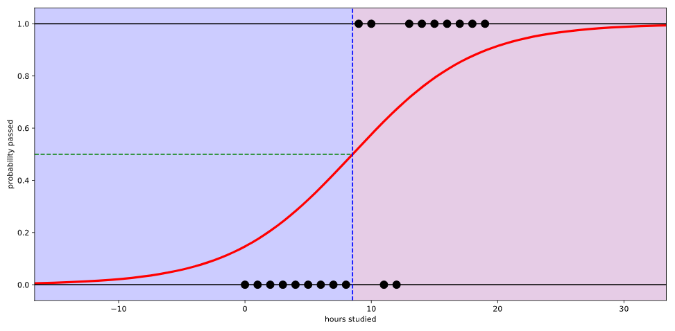
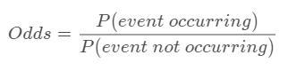

# Logistic Regression

### 1. 정의

`Logistic Regression`

: 회귀를 사용하여 데이터가 어떤 범주에 속할 **확률을 0에서 1사이의 값**으로 예측하고 그 확률에 따라 가능성이 더 높은 범주에 속하는 것으로 `Classfication`해주는 지도 학습 알고리즘이다. 

* `Regression`을 사용하지만 `Classification` 모델이다.

* 구현하기 매우 쉽고 선형적으로 구분되는 클래스에 뛰어난 성능을 낸다.

* `Logistic Regression`는 손쉽게 다중 클래스 설정으로 일반화할 수 있습니다.

  이를 `mulinomial logistic regression` 또는 `softmax regression`이라고 부릅니다. 

`Logistic Regression`에서는 데이터가 특정 범주에 속할 확률을 예측하기 위해 아래와 같은 단계를 거친다.

1. 모든 `feature`들의 `계수`와 `절편`을 `0`으로 초기화
2. 각 `feature`들의 값에 `계수`를 곱해서 **log-odds**를 구한다.
3. **log-odds**를 **sigmoid 함수**에 넣어서 `[0,1]` 범위의 확률을 구한다.

## 2. 이해

#### 1. Log-Odds

- `Linear Regression`에서는 각 `feature` 값에 `계수`를 곱하고 `절편`을 더해서 `예측 값`을 구한다.

- **Logistic Regression**에서는 `예측 값` 대신 **Log-Odds**를 구해줘야 한다.

- **Log-odds**를 어떻게 구하는지 알려면 일단 **odds**부터 계산해야 한다

  ​	= `P / (1-P)` : 여기서 `P`는` 양성 샘플 (y = 1)`일 확률

​		`odds` : `사건이 발생할 확률`을 `발생하지 하지 않을 확률`로 나눈 값

​		`log-odds` : `odds`에 `log`를 취한 것

#### 2. Sigmoid Function

- `Logistic Sigmoid Function`을 줄여서  `Sigmoid Function` 라고 부름

​		`log-odds`를 `Sigmoid Function`에 넣어서 `0부터 1사이의 값`으로 변환

 

#### 3. 요약

- 로지스틱 회귀 분석은 이진 분류를 수행하는 데 사용

  데이터 샘플을 양성(1) 또는 음성(0) 클래스 둘 중 어디에 속하는지 예측

- 각 `feature`들의 `log-odds`를 구한 후 `Sigmoid Function`를 적용

  실제로 데이터가 해당 클래스에 속할 확률을 `0과 1사이의 값`으로 나타낸다.