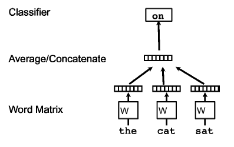
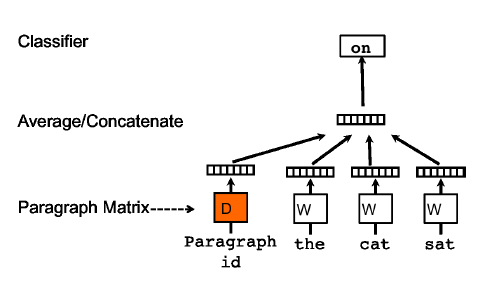
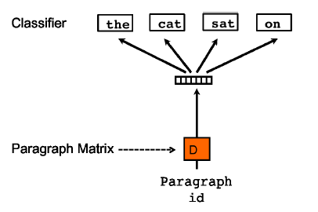

# 문장 수준의 임베딩

## 1. LSA

문서 임베딩을 만들기 위한 잠재 의미 분석(LSA)은 단어-문서 행렬이나 TF-IDF 행렬에 특이값 분해(SVD)를 시행하고, 차원 축소된 행렬에서 문서에 대응하는 vector를 취하는 방식이다.

## 2. Doc2Vec

: 단어 시퀀스 k 개가 주어졌을 때 다음 단어를 맞추는 언어 모델

- 기존 언어 모델

  : 문장 전체를 처음부터 끝까지 한 단어씩 슬라이딩해가면서 다음 단어가 무엇일지 예측한다.

- :star:**Doc2Vec, PV-DM**

  `the Distributed Memory Model of Paragraph Vectors`

  (PV-DBOW보다 일반적으로 많이 사용한다)

  : 각 문장마다 **`Paragraph id`**를 부여한다. 이외 과정은 위 기존 모델과 동일하다.

  - 이렇게 만든 문서 임베딩은 해당 문서의 **주제(의미)** 정보를 함축한다.
    - 동일한 문서 내 존재하는 모든 단어와 함께 학습될 기회를 갖기 때문

  - 해당 문서 임베딩에는 단어의 등장 **순서**를 고려하는 방식으로 학습한다.
    - 따라서 **순서 정보**를 무시하는 백 오브 워즈 기법 대비 강점이 있다.

- Doc2Vec, PV-DBOW

  `the Distributed Bag of Words version of Paragraph Vector`

  (Skip-Gram 모델을 본 뜸)

  : Paragraph id를 가지고 문맥 단어를 맞춘다.

  따라서 문서 ID에 해당하는 문서 임베딩엔 문서에 등장하는 **모든 단어의 의미 정보**가 반영된다.

  

## 3. Topic Model

## 4. ELMo

## 5. Transformer

아래 줄기를 이해해야 한다.

LSTM -> Seq2Seq -> Attetion -> Transformer

## 6. BERT

## 7. GPT